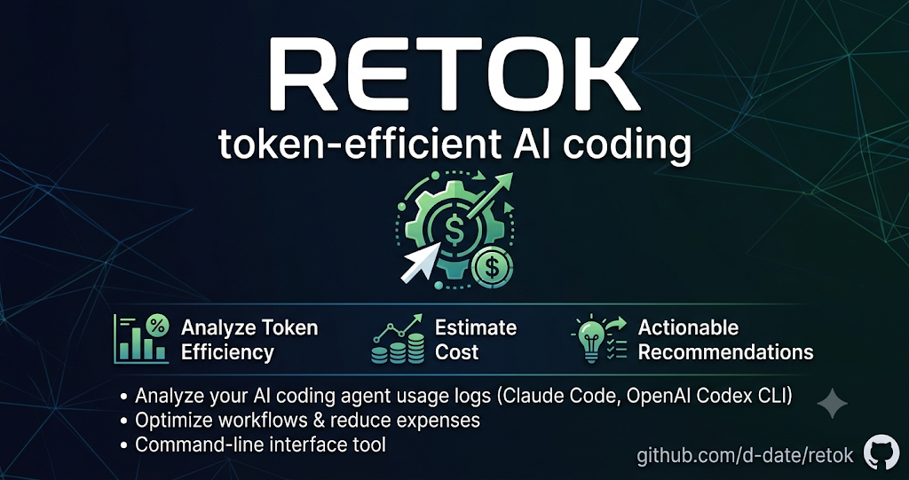

<<<<<<< Updated upstream
# retok(return-of-token)
||||||| Stash base
# return-of-token (retok)
=======
# retok
>>>>>>> Stashed changes



**English** | [日本語](README.ja.md)

A CLI tool that analyzes your AI coding agent usage logs — **Claude Code** and **OpenAI Codex CLI** — to measure **token efficiency**, estimate cost, and print actionable recommendations.

Runs on Python 3 with the standard library only — no dependencies.

```
══════════════════════════════════════════════════════════════════════════
  retok — Token Efficiency Report (last 30 days / 472 files)
══════════════════════════════════════════════════════════════════════════

■ Overview
  Estimated cost            $2,119.66
  Claude Code / Codex       $2,091.00 / $28.66
  Cache hit rate            89.4%
  Cost per prompt           $1.593
  ...

■ Recommendations

  ! Re-caching after cache TTL expiry: ~135.0M tokens ($873.49)
    Returning to a session left idle beyond the cache TTL (usually 1
    hour) re-caches the entire context at twice the input rate. ...
```

## Installation

Requires Python 3.7+. No dependencies.

```sh
git clone https://github.com/d-date/retok.git
cd retok
./retok
```

To run it from anywhere, symlink it into your `PATH` (the symlink is resolved, so translations in `locales/` keep working):

```sh
ln -s "$(pwd)/retok" ~/.local/bin/retok   # or /usr/local/bin/retok
retok
```

Alternatively, grab just the script — everything works, but the report falls back to English because `locales/` is not present:

```sh
curl -fsSLo ~/.local/bin/retok https://raw.githubusercontent.com/d-date/retok/main/retok
chmod +x ~/.local/bin/retok
```

## Usage

```sh
./retok                    # report for the last 30 days
./retok --days 7           # change the window
./retok --project myapp    # filter by project name (substring)
./retok --provider codex   # only one provider (claude | codex)
./retok --lang en          # report language (default: $LANG)
./retok --json             # JSON output for other tools
./retok --top 20           # rows in ranking tables
./retok --dirs ~/somewhere/projects       # override Claude Code roots
./retok --codex-dirs ~/somewhere/sessions # override Codex roots
```

By default it scans Claude Code transcripts in `~/.claude/projects` (plus `$CLAUDE_CONFIG_DIR/projects` when that environment variable is set) and Codex CLI rollouts in `~/.codex/sessions`. If you keep transcripts elsewhere (multiple profiles, custom config dirs), pass every root with `--dirs` / `--codex-dirs`. Usage records are deduplicated globally, so overlapping roots are never double-counted.

## What it measures

| Metric | Meaning |
|---|---|
| Estimated cost | USD estimate based on published per-model pricing (table below) |
| Cache hit rate | `cache_read / (input + cache_read + cache_write)` — higher is cheaper |
| Cost per prompt | Cost consumed per human instruction |
| Subagent share | Consumption by subagents (Task/Explore; `<session>/subagents/agent-*.jsonl`) |
| maxCtx | Peak context size within a session — the bigger, the more each request costs |

## Recommendation rules

- **Cache TTL expiry** — a large cache write (majority of the context) right after a gap longer than the write's TTL (1h/5m, detected from the usage buckets) means an expired prefix was re-cached from scratch. Suggests `/compact` / `/clear`
- **Oversized contexts** — sessions exceeding 120k tokens. Suggests `/clear` between tasks
- **Under-delegation** — high Read/Grep/Glob share on the main thread with little subagent use
- **Retry loops** — the same Bash command executed 5+ times within a session
- **Frequent interruptions** — `[Request interrupted by user]` above 12% of prompts. Suggests clearer prompts and Plan Mode
- **Premium models on tiny sessions** — one-shot Q&A on Opus/Fable-class models

## Cost model

Claude prices (USD / MTok, as of 2026-06):

| Model | input | output |
|---|---|---|
| Fable 5 / Mythos 5 | $10 | $50 |
| Opus 4.x | $5 | $25 |
| Sonnet 4.x / 5 | $3 | $15 |
| Haiku 4.5 | $1 | $5 |

- Cache read = **0.1×** input rate
- Cache write = **1.25×** input rate (5-minute TTL) / **2×** (1-hour TTL) — detected from the `cache_creation` buckets in usage
- One API response is written to the transcript as multiple entries; usage is deduplicated by `message.id`

OpenAI (Codex) prices (USD / MTok, as of 2026-07):

| Model | input | output |
|---|---|---|
| gpt-5.5 | $5 | $30 |
| gpt-5.4 | $2.50 | $15 |
| gpt-5.3 / 5.2 (codex) | $1.75 | $14 |
| gpt-5.1 / 5.1-codex-max / 5 | $1.25 | $10 |
| gpt-5-mini / nano | $0.25 / $0.05 | $2 / $0.40 |

- Cached input = **0.1×** input rate (no cache-write premium); `cached_input_tokens` is a subset of `input_tokens` and is unbundled before pricing
- Usage comes from `token_count` events in `~/.codex/sessions` rollout files, deduplicated by the cumulative token counter

> Note: figures are estimates based on published API pricing. If you are on a subscription plan (e.g. Max), read them as "how much compute you used in API terms", not what you actually paid.

## Languages

The report language follows `--lang`, then `RETOK_LANG`, then `LC_ALL` / `LC_MESSAGES` / `LANG`, falling back to English.

Available: `en` (built-in), `ja`, `zh-CN`, `zh-TW`, `ko`, `es`, `fr`, `de`, `pt-BR`.

### Adding a language

1. Copy `locales/ja.json` to `locales/<tag>.json` (BCP 47-ish tag, e.g. `it`, `pt-PT`)
2. Translate the values — keep the `{placeholders}` intact
3. Test with `./retok --lang <tag>` and open a pull request

Missing keys fall back to English automatically, so partial translations are fine.

## License

[MIT](LICENSE)
